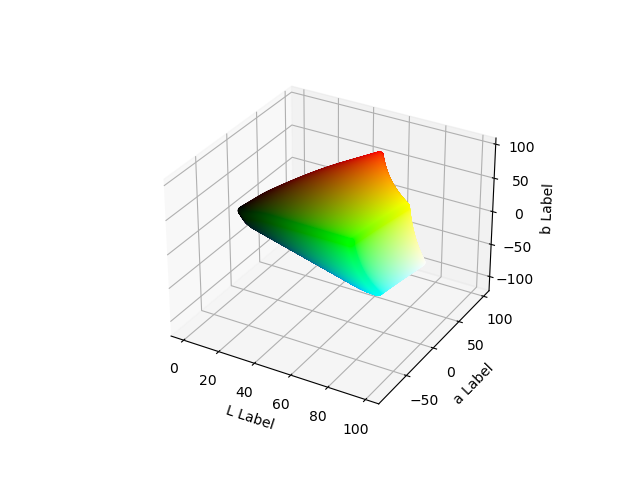
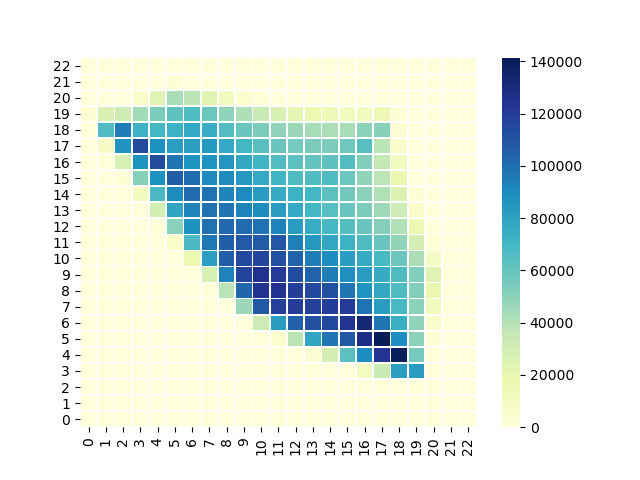
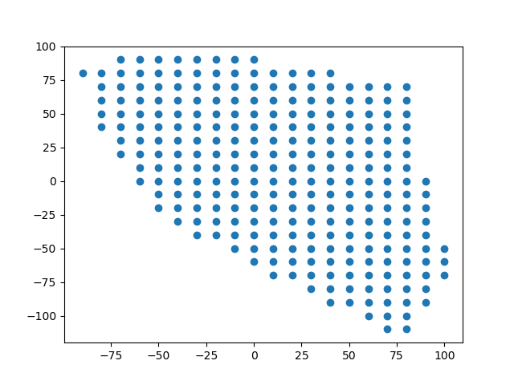
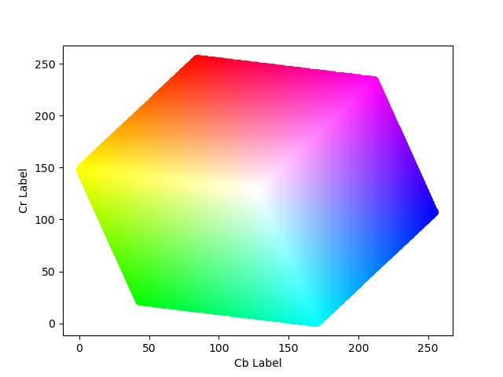
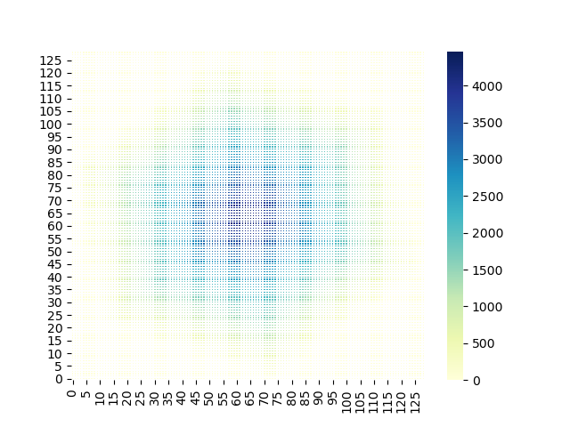
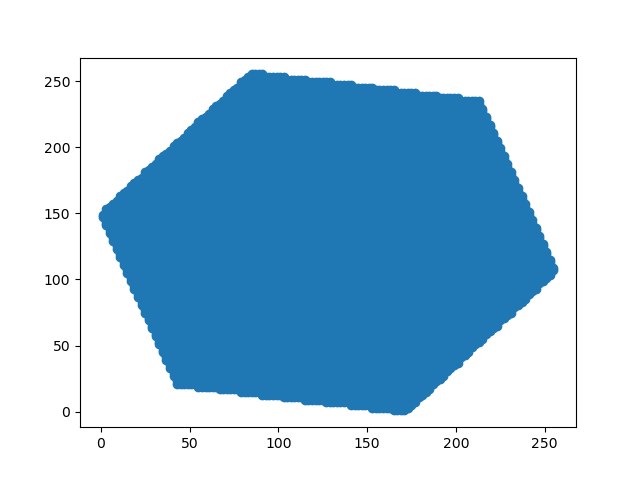

Easy code for create and visualize files in YCbCr colour space for ColourCaps project [Colourisation with capsules repo](https://github.com/Riretta/Colourisation_w_Capsules).
- create_prior_prob.py  -> create file prior_probs.npy
- quantization_colorspace.py -> create file pts_in_hull.npy

These files are needed for the colour quantization used in [Colourisation with capsules repo](https://github.com/Riretta/Colourisation_w_Capsules) -> resources folder.

Lab colour Space:

YCbCr colour Space:

All the image in this repo are property of the Authors:

#[Collaborative Image and Object Level Features for Image Colourisation](https://openaccess.thecvf.com/content/CVPR2021W/WiCV/papers/Pucci_Collaborative_Image_and_Object_Level_Features_for_Image_Colourisation_CVPRW_2021_paper.pdf)#

@article{pucci2021collaboration,
  title={Collaboration among Image and Object Level Features for Image Colourisation},
  author={Pucci, Rita and Micheloni, Christian and Martinel, Niki},
  journal={arXiv preprint arXiv:2101.07576},
  year={2021}
}

and:

#[Pro-CCaps: Progressively Teaching Colourisation to Capsules](https://openaccess.thecvf.com/content/WACV2022/papers/Pucci_Pro-CCaps_Progressively_Teaching_Colourisation_to_Capsules_WACV_2022_paper.pdf)#

@inproceedings{pucci2022pro,
  title={Pro-CCaps: Progressively Teaching Colourisation to Capsules},
  author={Pucci, Rita and Micheloni, Christian and Foresti, Gian Luca and Martinel, Niki},
  booktitle={Proceedings of the IEEE/CVF Winter Conference on Applications of Computer Vision},
  pages={2271--2279},
  year={2022}
}

                                                                                                                         
                                                                                                                         
